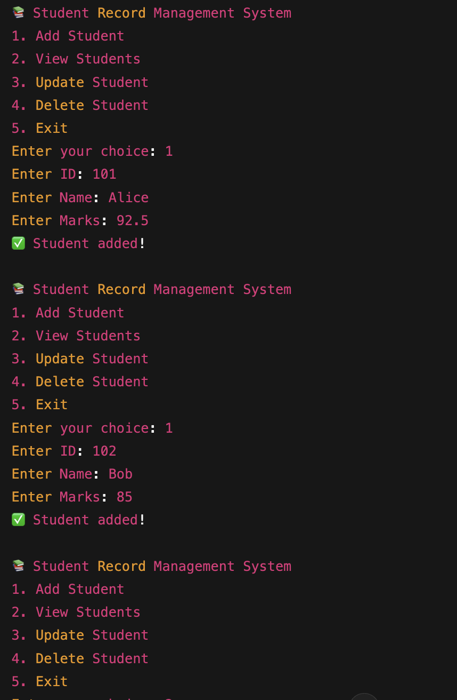

# Student Record Management System

This is a simple Java CLI project to manage student records using an `ArrayList`.

## Features

- Add new students
- View all student records
- Update student data by ID
- Delete students by ID

## Technologies Used

- Java
- ArrayList
- Scanner class

## Screenshot

## How to Run

1. Paste the code into any Java compiler like [OneCompiler](https://onecompiler.com/java)
2. Compile and run
3. Use the CLI menu to manage students

## Author

BUPANA VARSHITH
